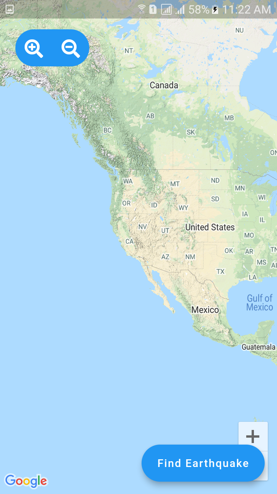
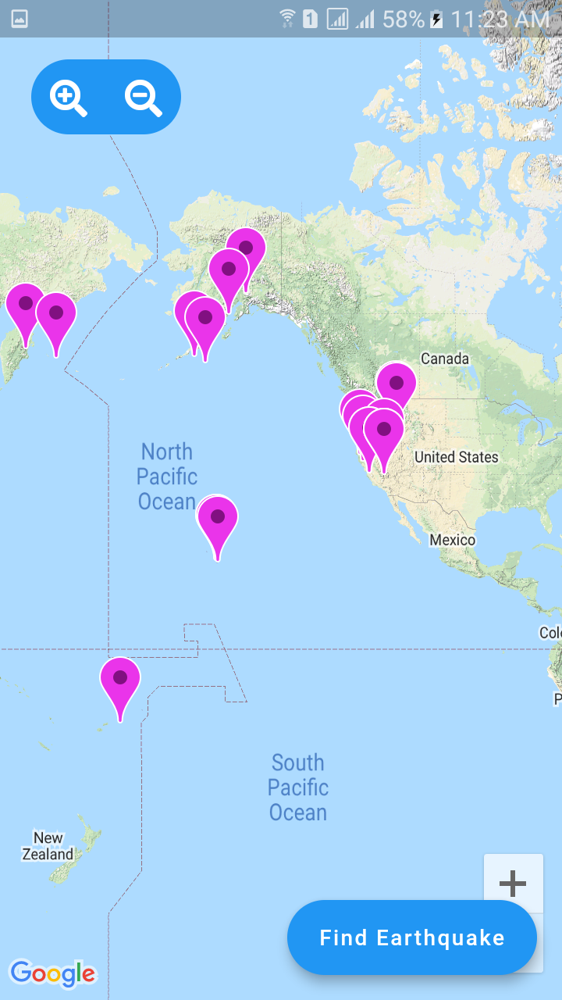
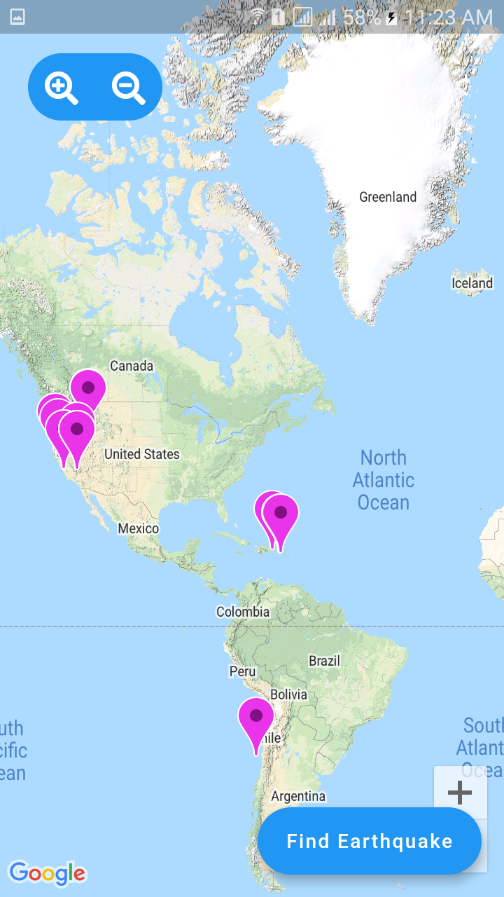
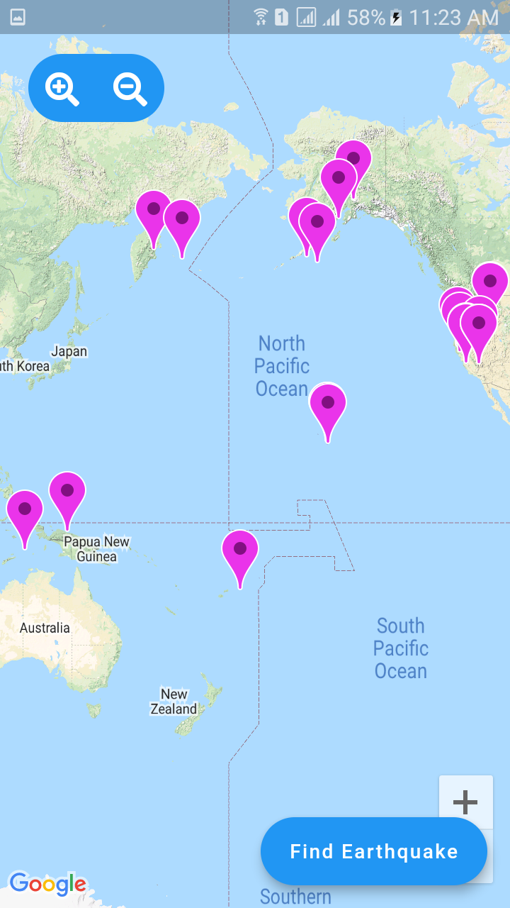
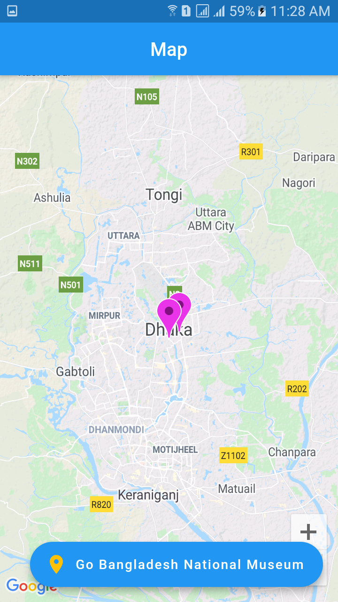
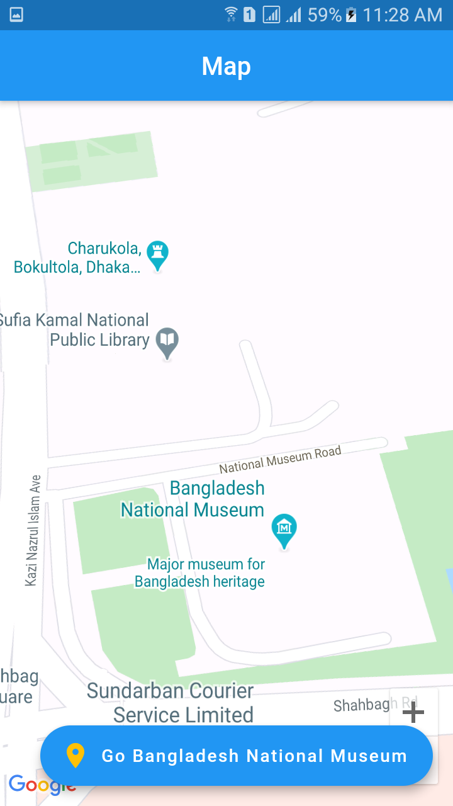

# google_maps
## What will we learn follow bellow 

- how to use google map in flutter app 
- how to use country city location set 
- how to use google_map widget
- how to implement api in flutter google map app

################screenshots###################

      
